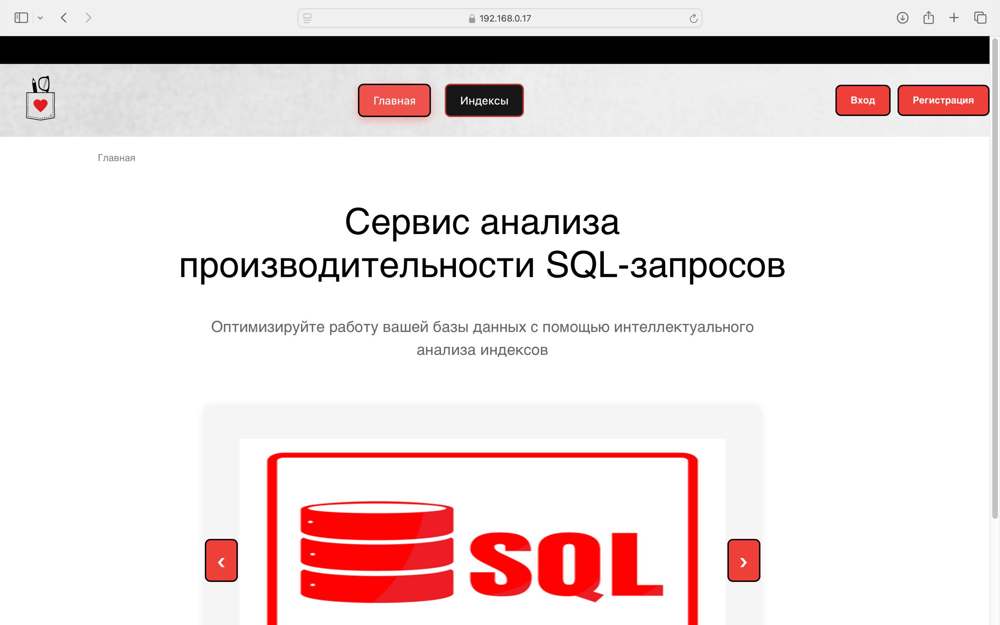
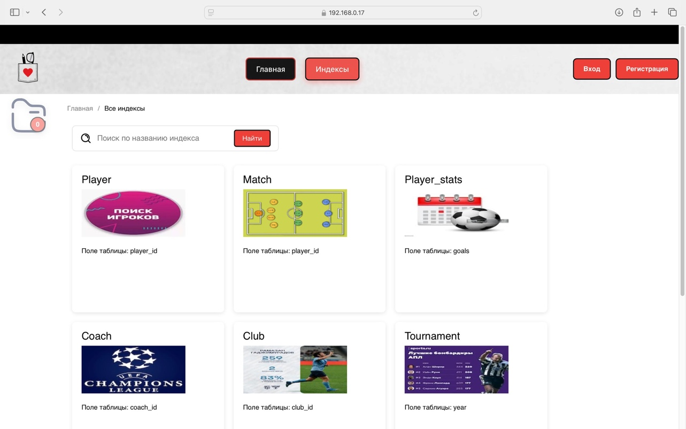
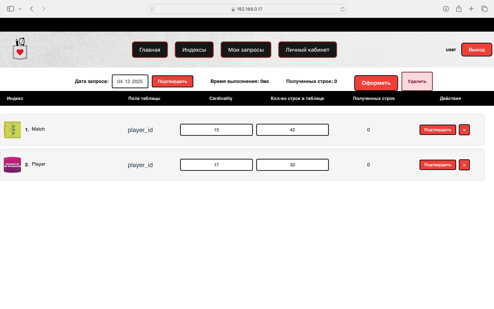
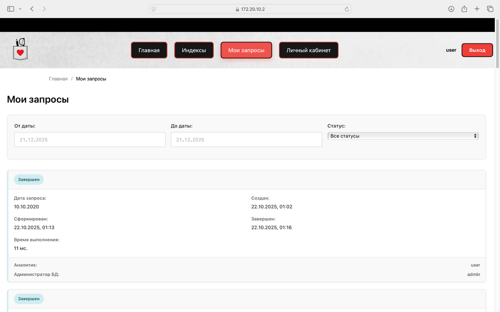
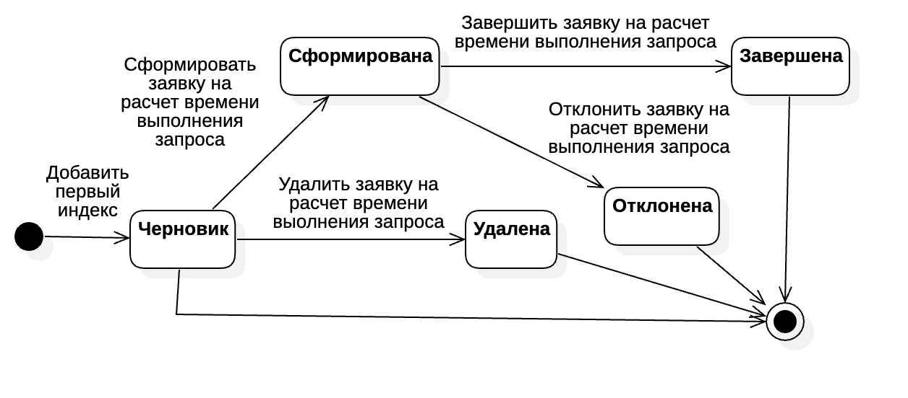
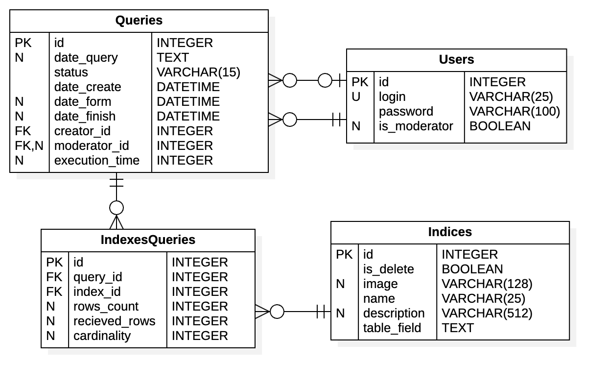
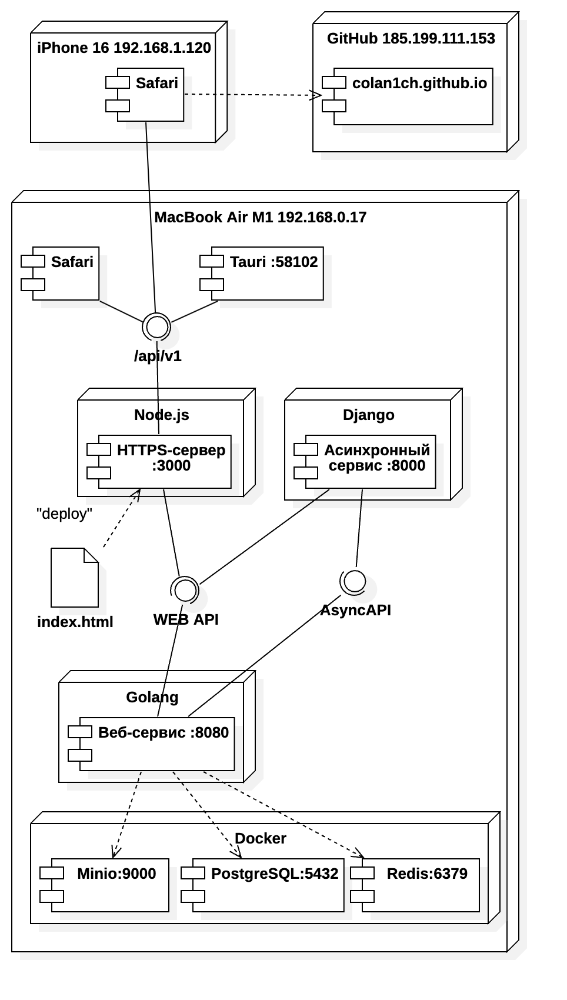
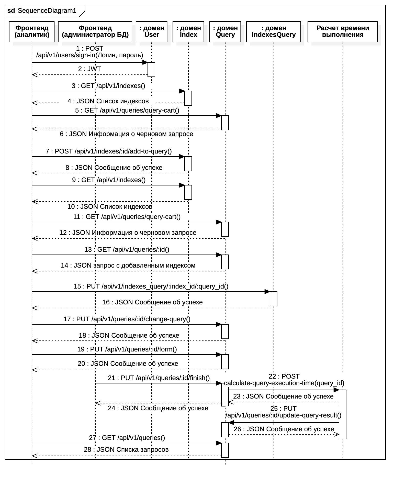

# Разработка интернет-приложений: SQL Analyzer

## Краткое описание

SQL Analyzer — учебная система для анализа производительности SQL-запросов с использованием индексов. Репозиторий содержит фронтенд приложения курса «Разработка интернет-приложений» и итоговую версию лабораторной работы № 8.

Система позволяет просматривать индексы, формировать запрос на расчёт, работать с заявками пользователя и просматривать профиль. Фронтенд взаимодействует с API основного веб-сервиса, использует авторизацию, Redux Toolkit, PWA-конфигурацию и сгенерированный по Swagger клиент.

## Основные возможности

- просмотр главной страницы и списка индексов;
- поиск индексов по названию;
- просмотр отдельного индекса;
- формирование и редактирование заявки на расчёт SQL-запроса;
- просмотр списка заявок и детальной страницы заявки;
- регистрация, вход, выход и просмотр личного кабинета;
- хранение состояния авторизации, фильтров, индексов и заявок в Redux Toolkit;
- обращение к API через Axios и клиент, сгенерированный из `swagger.json`;
- PWA-манифест, service worker и адаптивная вёрстка;
- локальное HTTPS и проксирование `/api` и `/images` в конфигурации Vite.

## Лабораторные работы и ветки

Названия и назначение лабораторных приведены по материалам курса из [README курса](https://github.com/iu5git/Web/blob/master/README.md). Ссылки ведут на соответствующие ветки учебных репозиториев.

1. [Лабораторная работа № 1 — дизайн и базовая серверная шаблонизация](https://github.com/colan1ch/sql-analyzer-web-service/tree/sql_analyzer_srr_in_memory) — основной веб-сервис, хранение данных в памяти.
2. [Лабораторная работа № 2 — PostgreSQL и подключение базы данных](https://github.com/colan1ch/sql-analyzer-web-service/tree/sql_analyzer_db_implementation) — основной веб-сервис с базой данных.
3. [Лабораторная работа № 3 — веб-сервис для SPA](https://github.com/colan1ch/sql-analyzer-web-service/tree/SPA_backend) — API бизнес-логики без авторизации.
4. [Лабораторная работа № 4 — авторизация и Swagger](https://github.com/colan1ch/sql-analyzer-web-service/tree/SPA_backend_swagger) — итоговая ветка основного веб-сервиса.
5. [Лабораторная работа № 5 — базовый SPA на React и TypeScript](https://github.com/colan1ch/sql-analyzer/tree/SPA_frontend_react) — базовый фронтенд.
6. [Лабораторная работа № 6 — подключение API и мультимодальный поиск](https://github.com/colan1ch/sql-analyzer/tree/redux_tools) — ветка промежуточной реализации фронтенда.
7. [Лабораторная работа № 7 — Redux Toolkit, Axios и оформление заявок](https://github.com/colan1ch/sql-analyzer/tree/redux_toolkit_axios) — авторизованный пользовательский интерфейс.
8. [Лабораторная работа № 8 — адаптивность, PWA и развёртывание](https://github.com/colan1ch/sql-analyzer/tree/admin_if_lab8) — текущая версия фронтенда в `main`.

Дополнительный асинхронный сервис вынесен в отдельный репозиторий: [ветка `async_web_service`](https://github.com/colan1ch/sql-analyzer-async-web-service/tree/async_web_service).

## Демонстрация работы

Из отчёта «РПЗ Чернев ИУ5-54Б» в репозиторий добавлены основные экраны приложения и ключевые диаграммы.

<p align="center"></p>
<p align="center">Рисунок 1 — Главная страница приложения</p>

На экране отображается название сервиса, краткое назначение и навигация по разделам. Доступны переходы на главную страницу и список индексов, а для неавторизованного пользователя — вход и регистрация.

<p align="center"></p>
<p align="center">Рисунок 2 — Список индексов</p>

Страница содержит хлебные крошки, поле поиска по названию и карточки индексов с изображением, названием и полем таблицы. Через карточку можно перейти к подробной информации об индексе.

<p align="center"></p>
<p align="center">Рисунок 3 — Страница сформированного запроса</p>

Авторизованный пользователь видит дату запроса, статус, время выполнения, число полученных строк и состав заявки. Для элементов заявки доступны действия подтверждения, удаления и оформления запроса.

<p align="center"></p>
<p align="center">Рисунок 4 — Список заявок пользователя</p>

На странице доступны фильтры по диапазону дат и статусу. В карточках отображаются дата и статус заявки, сведения о создании, формировании и завершении, время выполнения, а также создатель и администратор базы данных.

<p align="center"></p>
<p align="center">Рисунок 5 — Диаграмма состояний заявки</p>

Диаграмма показывает переходы между состояниями «Черновик», «Сформирована», «Завершена», «Отклонена» и «Удалена», включая действия пользователя и администратора базы данных.

<p align="center"></p>
<p align="center">Рисунок 6 — Логическая схема базы данных</p>

Схема содержит таблицы `Queries`, `Users`, `Indexes` и связующую таблицу `IndexesQueries`, их основные поля, первичные и внешние ключи, а также кардинальности связей.

<p align="center"></p>
<p align="center">Рисунок 7 — Диаграмма развёртывания системы</p>

На диаграмме показано взаимодействие браузера и Tauri с фронтендом, веб-сервисом на Go, асинхронным сервисом, GitHub Pages и контейнерами MinIO, PostgreSQL и Redis.

<p align="center"></p>
<p align="center">Рисунок 8 — Диаграмма последовательности API-вызовов</p>

Диаграмма показывает последовательность авторизации, получения индексов и заявки, добавления индекса, изменения и формирования заявки, вызова асинхронного расчёта, обновления результата и получения списка заявок.

## Стек технологий

- React `^19.1.1`, React DOM `^19.1.1`;
- TypeScript `~5.9.3`, Vite `^7.1.7`;
- React Router DOM `^7.9.5`;
- Redux Toolkit `^2.10.1`, React Redux `^9.2.0`, Redux Thunk `^3.1.0`;
- Axios `^1.13.2`;
- Swagger TypeScript API `^13.2.16` для генерации клиента по `swagger.json`;
- Vite PWA Plugin `^1.1.0`, Vite Mkcert Plugin `^1.17.9`;
- ESLint `^9.36.0` и TypeScript ESLint `^8.45.0`.

Серверная часть описана в [README основного веб-сервиса](https://github.com/colan1ch/sql-analyzer-web-service) и [README асинхронного сервиса](https://github.com/colan1ch/sql-analyzer-async-web-service).

## Установка и запуск

Требуется Node.js с npm.

```bash
npm install
npm run dev
```

Проверка и сборка:

```bash
npm run lint
npm run build
npm run preview
```

Доступные скрипты и их точные определения находятся в [`package.json`](package.json). В `vite.config.ts` указаны порт разработки `3000`, прокси основного API на `http://localhost:8080` и прокси изображений на `http://172.20.10.2:9000`. Конфигурация также ожидает файлы `ca.key` и `ca.crt` для HTTPS.

## Примеры использования и API

Клиент API сгенерирован в [`src/api/Api.ts`](src/api/Api.ts), исходное описание API находится в [`swagger.json`](swagger.json). Команда повторной генерации клиента:

```bash
npm run generate-api
```

Основные страницы маршрутизации определены в [`src/Routes.tsx`](src/Routes.tsx), запросы к индексам — в [`src/modules/IndexesApi.ts`](src/modules/IndexesApi.ts), состояние приложения — в [`src/store`](src/store).

## Структура проекта

```text
src/
├── api/              сгенерированный Axios-клиент API
├── components/       общие компоненты интерфейса
├── modules/          типы и запросы индексов
├── pages/            страницы приложения
├── store/            Redux store и slices
├── APP.tsx           корневой компонент
└── Routes.tsx        маршрутизация
public/               статические файлы и PWA-ресурсы
docs/demo/            иллюстрации из отчёта
dist/                 собранная версия фронтенда
vite.config.ts        конфигурация Vite, прокси, HTTPS и PWA
swagger.json          спецификация API
```

## Важные материалы

- [Основной веб-сервис](https://github.com/colan1ch/sql-analyzer-web-service)
- [Асинхронный веб-сервис](https://github.com/colan1ch/sql-analyzer-async-web-service)
- [Документация Swagger](swagger.json)
- [Сгенерированный API-клиент](src/api/Api.ts)
- [Состояние приложения](src/store)
- [Демонстрационные материалы и диаграммы](docs/demo)

## Статус проекта

Учебный проект курса «Разработка интернет-приложений». В `main` находится финальная версия фронтенда из ветки `admin_if_lab8`, объединённая с историей лабораторных работ. Основной и асинхронный сервисы поддерживаются в отдельных репозиториях и также имеют финальные версии в своих ветках `main`.

## Описание для GitHub

Сервис анализа производительности SQL-запросов и управления индексами. Стек: React, TypeScript, Vite, Redux Toolkit, Axios, Go, PostgreSQL, Redis, MinIO и Django. Репозиторий содержит фронтенд и материалы лабораторных работ курса «Разработка интернет-приложений».
